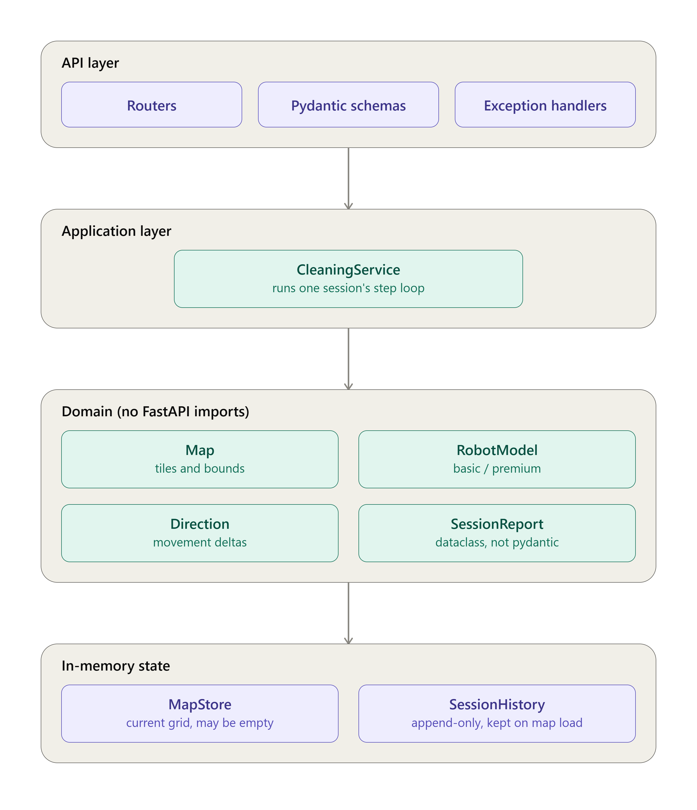
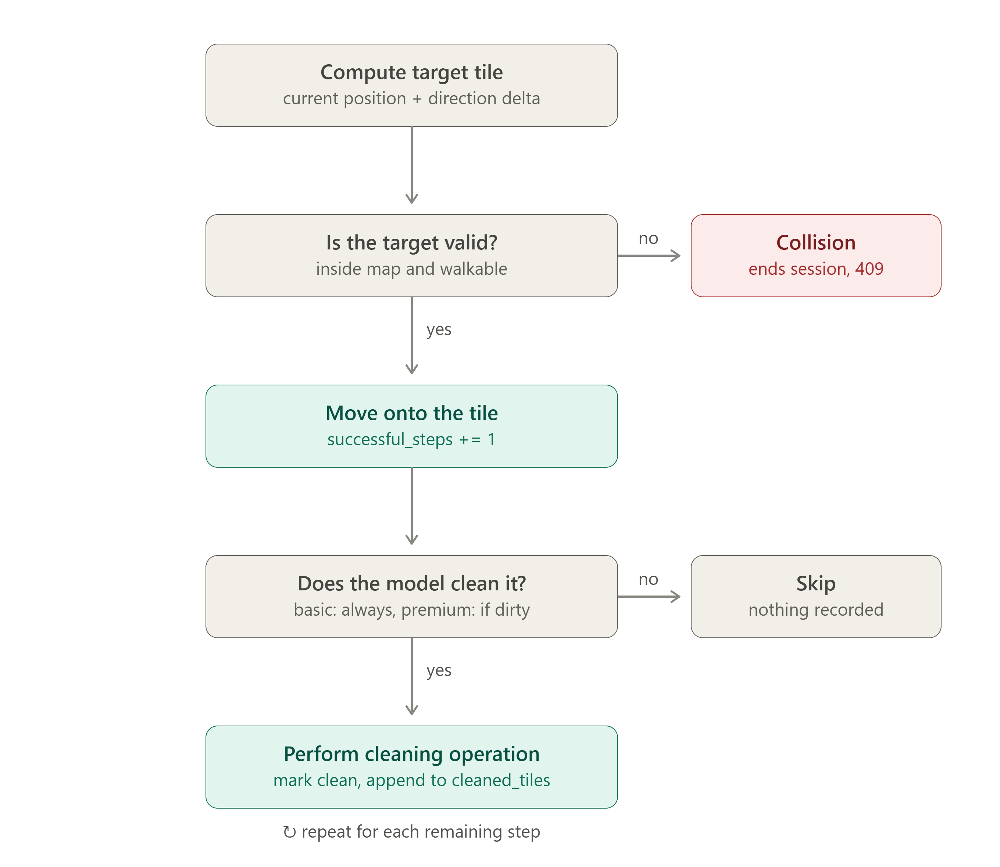
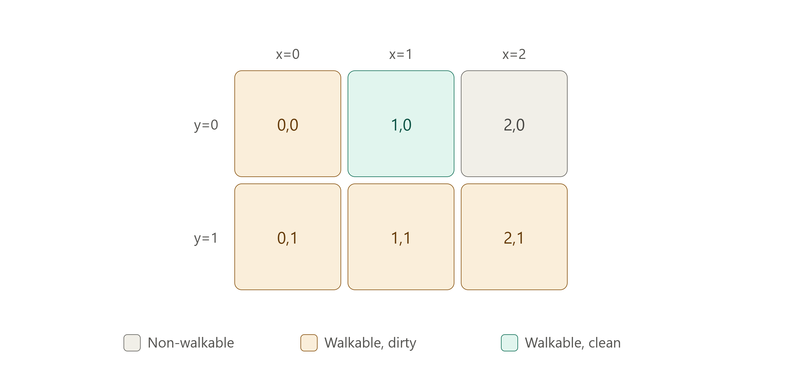
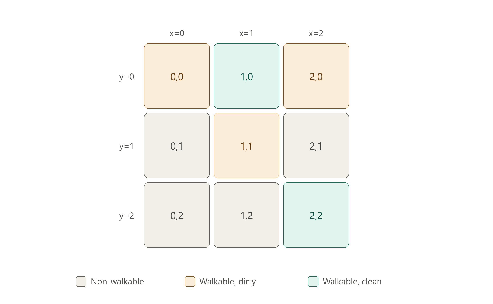

# Cleaning Robot API

A REST service that remotely controls a household cleaning robot: load a
tile map, run cleaning sessions with a `basic` or `premium` robot model,
and export session history as CSV.

All state (loaded map, session history) lives in memory for the process
lifetime. Restarting the service clears it.

## Prerequisites

- **Docker** (for the Docker path), **or**
- **Python 3.12+** and either **[uv](https://docs.astral.sh/uv/)** or **pip** (for the local path).

## Installation

Clone the repository:

```bash
git clone https://github.com/lorycontixd/cleaning-robot-api.git
cd cleaning-robot-api
```

Pick **one** of the setups below.

### Docker

```bash
docker build -t cleaning-robot .
docker run --rm -p 8000:8000 cleaning-robot
```

Note: the Docker build runs the test suite as part of the image build (`RUN pytest` in the [Dockerfile](Dockerfile)), so a failing test fails the build.

### Local - uv

```bash
uv sync --extra dev
```

`--extra dev` installs `pytest`, `httpx`, `ruff`, and `mypy` — the tools declared as optional dependencies in [pyproject.toml](pyproject.toml). Without it, `pytest` and the linters will not be available.

### Local - pip

```bash
python -m venv .venv
# Windows:      .venv\Scripts\activate
# Linux/macOS:  source .venv/bin/activate
python -m pip install -e ".[dev]"
```

## Run

Start the API on `http://localhost:8000`:

```bash
# uv
uv run uvicorn app.api.main:app --reload --host 0.0.0.0 --port 8000

# pip / activated venv
python -m uvicorn app.api.main:app --reload --host 0.0.0.0 --port 8000
```

## Verify

Quick health check:

```bash
curl http://localhost:8000/health
# {"status":"ok"}
```

Interactive API docs (Swagger UI) are available at [http://localhost:8000/docs](http://localhost:8000/docs). Use them to try the endpoints without writing a client.

### End-to-end smoke test

1. Upload a small text map (`o` = walkable/dirty, `x` = wall):

   ```bash
   printf "oox\noox\n" > sample.txt
   curl -X PUT http://localhost:8000/map -F "file=@sample.txt"
   ```
2. Run a cleaning session:

   ```bash
   curl -X POST http://localhost:8000/clean \
     -H "Content-Type: application/json" \
     -d '{
       "start": {"x": 0, "y": 0},
       "robot_model": "basic",
       "actions": [
         {"direction": "east",  "steps": 1},
         {"direction": "south", "steps": 1}
       ]
     }'
   ```
3. Export the history as CSV:

   ```bash
   curl http://localhost:8000/history
   ```

## Tests and quality checks

```bash
pytest           # test suite
ruff check .     # lint
ruff format .    # format
```

Under `uv`, prefix with `uv run` (e.g. `uv run pytest`).

## Project structure

The project follows a typical FastAPI layout with a strong focus on maintainability and a clear separation of concerns:

- `app/api/` - FastAPI routes, request/response schemas, exception handlers.
- `app/core/` - framework-agnostic domain models and exceptions.
- `app/services/` - orchestration layer. `CleaningService` runs cleaning sessions and coordinates the robot, map, and history.
- `app/maps/` - map parsing (`.txt` and `.json`).
- `app/storage/` - in-process stores for the current map and session history.
- `data/` - directory for storing sample maps and other data files.
- `scripts/` - utility scripts for development and maintenance tasks, such as smoke tests.
- `media/` - static media files used in the documentation.
- `tests/` - unit and end-to-end tests.

## Architecture

The service is organised in layers. Control flows top-to-bottom: the API
delegates to the application service, which drives the domain logic and reads
and writes the in-memory stores. The domain layer (`app/core/`) has no FastAPI
imports, so it can be unit-tested in isolation.



- **API layer** (`app/api/`) — routers, Pydantic request/response schemas, and
  exception handlers that map domain errors to HTTP status codes.
- **Application layer** (`app/services/`) — `CleaningService` orchestrates one
  cleaning session: it fetches the current map, validates the start position,
  runs the session, and records the report in history.
- **Domain** (`app/core/`) — framework-agnostic building blocks: the map (grid
  of tiles and bounds), the robot model (`basic` / `premium`), directions
  (movement deltas), and the session report.
- **In-memory state** (`app/storage/`) — `MapStore` holds the current map (may
  be empty) and `SessionHistory` is append-only and is kept across map reloads.

### The step loop

`POST /clean` processes the starting tile first, then executes each action one
step at a time. Every step runs the same loop inside the orchestrator:



1. **Compute the target tile** from the current position and the direction delta.
2. **Validate the target** — it must be inside the map and walkable. An invalid
   target is a collision: the session stops at once, keeps the cleaning already
   performed, and returns HTTP `409` with an error report.
3. **Move** onto the tile and increment `successful_steps`.
4. **Decide whether to clean** — `basic` always cleans, `premium` only cleans a
   dirty tile. When it cleans, the tile is marked clean and appended to
   `cleaned_tiles`; otherwise it is skipped and nothing is recorded.

The loop repeats until all steps finish or a collision ends the session.

## Sample maps

Two ready-to-load maps live in [data/](data/) and mirror the fixtures used by
the test suite ([tests/conftest.py](tests/conftest.py)). They are handy for
manual testing and are used by the smoke-test script ([scripts/smoke_test.ps1](scripts/smoke_test.ps1)).

Both files use the JSON map format (`PUT /map` accepts `.json` and `.txt`). The ASCII previews below use the same legend as the map renderer:

- `o` - walkable, initially **dirty**
- `.` - walkable, initially **clean**
- `x` - non-walkable (wall)

### `23_map` - [data/23_map.json](data/23_map.json)

2 rows × 3 columns, 5 walkable tiles.

```text
o . x
o o o
```



### `sample_map` - [data/sample_map.json](data/sample_map.json)

3 rows × 3 columns, 5 walkable tiles. The top row is walkable, with a single
walkable tile below the centre and an isolated walkable tile in the
bottom-right corner (walled off on every side).

```text
o . o
x o x
x x .
```



## Design notes

- **Validation at the boundary.** The API layer validates incoming requests with Pydantic. The core layer does not fully trust upstream data and re-checks its own invariants — most unit tests construct domain objects directly and bypass the API, so those checks matter.
- **The map owns the state.** The map is the single source of truth for tile walkability and cleanliness. The robot is a transient agent that operates on the map.
- **Cleanliness persists across sessions.** The map is mutated in place, so a tile cleaned in one session stays clean in the next — until a new map is loaded via `PUT /map`.
